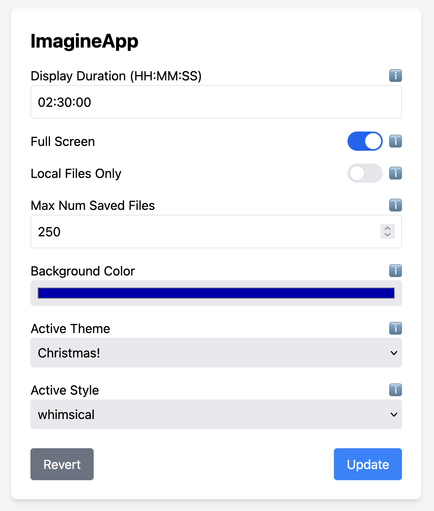

# Overview of ImagineApp




This is a web-app meant to control a single instance of ImagineImage. The
web-app allows you to set various configuration values and affect the
image app in more-or-less real time.

The file will modify is: `..ImagineImage/config_local.json` Note the relative
placement; this implies that `ImagineImage` and `ImagineApp` are at the same
level in the file hierarchy.

The sample screenshot to the right is detailing a configuration file that looks like this:
```json
{
    "display_duration": "02:30:00",
    "full_screen": true,
    "local_files_only": false,
    "max_num_saved_files": 250,
    "background_color": "#0000aa",
    "active_style": "whimsical",
    "active_theme": "christmas.yaml"
}
```
Nate that if you modify the file by hand, you can reload it in the ImagineApp UI by clicking
the Revert button.

## Run the app

### Shell
```bash
python app.py
```
Then, hit the app with your browser: https://127.0.0.1:5000/
### PyCharm
Add the option --cert=adhoc to your server configuration in your Run/Debug Configurations menu in Pycharm.

https://stackoverflow.com/questions/59554188/why-doesnt-pycharm-run-a-flask-webapp-in-https

# GitHub

https://github.com/rkbenton/ImagineApp

